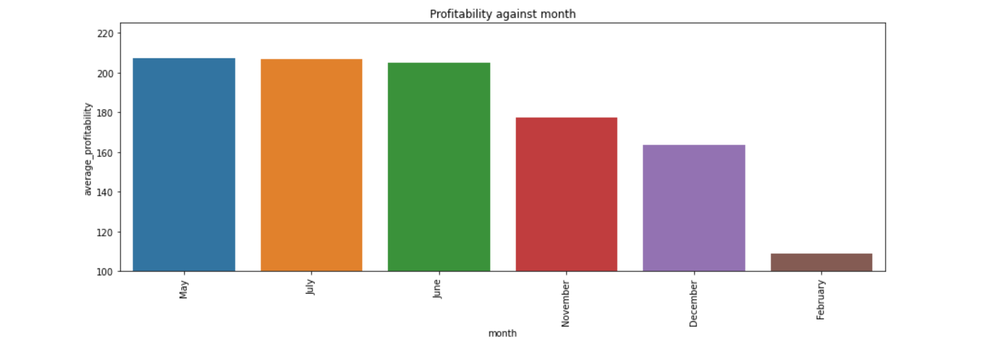

 
# Amazon BOX OFFICE MOVIES ANALYSIS

## Business  problems

My analysis was based on identifying the top performing movies at the box office based on:
1. Popularity of genres.

2. Profitability of genres.

3. Popularity of movies based release months.

4. Proftability of movies based on release months.

## Project Overview

The first thing i did was load all the libraries i needed for this particular analysis.

### Cleaning the  tmdb.movies csv file
Used this file because i needed the release data column to analyse which months were the most profitable and popular

1. Started by loading the file and looking at the first three rows of the file so as to have an idea of what its contents were.

2. Checked for duplication of movie names in the title column and found 1,829 dublicate movie titles. I kept the the first appearing movie titles and dropped all their dublicates.

3. Removed the unnamed column as the index and dropped the genre ids column, id column, title column and unnammed column because i didn't need them

### Cleaning the title basics file.
My reason for using this file was because of the genres column that i was going to use for my analysis of the profitability and popularity of movies based on their genres.

1. Loaded and read the file to get a sense of its contents.

2. Checked the original and primary title movie columns for duplicates. There were 10,073 duplicate movie titles in the primary title column, and 8370 duplicate movie columns in the original title column. I removed all the duplicate movie titles and only kept the first ones and asserted that there were no more duplicate movie titles.

3. Checked for the percentage of null values. The runtime minutes column had a percentage of 21.65 missing values. However i wasnt using this column for any of my analysis so i dropped it. 
   - The genre column had a 3.56% of missing values. I filled this missing values with the mode of genres and asserted that there were no null values in the genre column.

4. Dropped all the sub-genres to make use of the main genres and asserted that they had been dropped using the [ .unique() ] method

### cleaning the tn.movie budgets file
1. loaded the data

2. Reviewed the information to gain a general understanding of the file contents.

3. Checked for null values

4. Removed special characters from the numeric values in the production budget, worldwide gross and domestic gross columns

5. Examined the percentage of empty rows in the above columns that could have been shown as 0.0 but were not dropped because all of the top grossing movies contained all of the information I required.

6. Added a profitability column

7. To get rid of the scientific notations, rounded off all of the values to the nearest million.

8. Deleted the id column because it would not be used in the analysis.

### CONVERTING MY DATA TO SQL.
Used sql in my analysis because my analysis was making  use of relational data 
and SQL excels at performing joins which combine data from multiple tables.

    import sqlite3
Imports the SQLite3 Python module, which provides a simple interface for working with SQLite databases.

    conn = sqlite3.connect('film_analysis_information.db')
Conn connects to the SQLite database called "film_analysis_information.db." The connect function generates a connection object (conn) that enables database interaction.
 
    cursor = conn.cursor() 
Creates a cursor object (cursor) associated with the connection after it is created. The cursor object is used to execute SQL commands and retrieve database results.

    
4. Created the tables:

   a. Film_info table containing information from the movie_information data frame
    
   b. Film_budgets table containing information from the movie_budgets data frame
    
   c. Tmdb_ratings table containing information from the tmdb_ratings data frame

5. Moved the data to the sql tables

       movie_information.to_sql('film_info', conn, if_exists='replace', index=False)
This line saves the dataframe movie_information as a new table named 'film_info' in the SQLite database 

      if_exists='replace'
This parameter is set at replace so that it can drop the film-info table from the database if it exists and replace it with this new one
     
    index=False 
Specifies whether the dataframe's index should be included as a column in the table. its set to false meaning there won't be any index column. 
         
  - Used the same parameters and steps to move information to the ratings and budgets sql tables.
  
6. Created a query joining columns from all the tables created to assert that all the information had been properly movied.

# BUSINESS PROBLEM SOLUTIONS.

This section contains the analysis of the relationship between release months and genre on the profitability and popularity of movies.

1. **PROFITABILITY OF MOVIES BASED ON GENRES**

Wrote a query to show the top ten most profitable movie genres in the box office. Adventure movies came on top with a profit of 261.45 million dollars.

visual presentation of profitable genres.
    

2. **POPUlARITY OF MOVIES BASED ON GENRES**

Wrote a query to get the top ten most popular genres in the box office. Action movies were the most popular movie genres in the box office with an average popularity of 7.28.

visual presentation of popular genres.

3. **POPULARITY AND PROFITABILITY OF MOVIES BASED ON GENERES**

Created a data base with similar genres from profitability and popularity to figure out which genres were both one of the most profitable and most popular

  a. Created a dataframe (genre_profitability) with genres that were  profitable.
  
    genre_profitability = pd.DataFrame(data) 
Using pd.DataFrame generates a pandas DataFrame named genre_profitability that takes the data dictionary {} as input.
         
   
  b. Created a dataframe (genre_popularity) with genres that were popular.
    
    genre_popularity = pd.DataFrame(data1)
Using pd.DataFrame  generates a pandas DataFrame named genre_popularity that takes the data1 dictionary {} as input.
    
    
  c.Merging the dataframes
    
    genre_popularity_profitability= pd.merge(genre_profitability, genre_popularity, on='genres', how='inner')
    
This code merges the genre popularity and genre profitability dataframes into a new data frame
called genre_popularity_profitability. The merge is performed based on the column genres [ on=genres ] 
using an inner join [ how=inner ] that only includes movie genres that are in both dataframes
    
visual presentation of the popular and profitable genres.
  
  
  

**POPULARITY OF MOVIES BASED ON MONTHS

Created a query to get the top six most popular. 
    
      WHEN strftime('%m', t.release_date) = '01' THEN 'January'
   
[WHEN] conditional statment.
    
[Strftime] format date.
    
['%m', t.release_date] extracts the month part from each release date in the table.
    
[THEN 'January'] If the condition is true (i.e., the month part of the release date is '01' or January), the result of this statement will be 'January'.

December releases were the most popular, with an average popularity of 3.60.

visual presentation of popular months.

**PROFITABILITY OF MOVIES BASED ON MONTHS**
 
1. Created a query for the profitability of movies based on the months.
    Used the same method to extract the months.
    
2. Joined the tmdb_ratings table to get the month columns and the film budgets to get the profitability column.

May was the most profitable month in the box office with an average profit of 207.36.
     
visual presentation of profitable months.

**POPULARITY AND PROFITABILITY OF MOVIES BASED ON MONTHS

Created a popularity dataframe.

    popular_months = pd.DataFrame(data2)
This line of code uses the pandas DataFrame constructor
to create a new DataFrame named popular_months from the data stored in data2.

    profitable_months = pd.DataFrame(data3) 
This line of code uses the pandas DataFrame constructor 
to create a new DataFrame named profitable months from the data in data3.

1. Merging dataframes.

       most_popular_profitable_months= pd.merge(profitable_months,popular_months, on='months',how = 'inner') 
    
joined the profitable months and popular months data frames into a new data frame most_popular and profitable_months. The merge is performed based on the column months [ on=months ] using an inner join [ how=inner ] that only includes release months that are in both dataframe.

visual presentation of popular and profitable months.

## INSIGHTS
1.For industry success certain movie genres which include adventure, animation, action, mystery, romance, biography, and comedy should be given priority to maximize return on investment.

2. Certain release months specifically, the months of December, July, February, and November should be prioritized to capitalize on peak audience interest and maximize profitability.

3.Extensive market research and trend analysis is critical for the organization's success in the rapidly evolving world of entertainment. This will enable us to stay informed about our audiences’ changing preferences, and adapt and seize opportunities as they present themselves.

4.Aligning film production schedules with high-performing months and focusing on high-performing genre production is a critical strategy for improving box office performance. By being aware of audience preferences and market trends, we can position our films for greater success, resulting in not only increased revenue but also a stronger presence in the film industry.
